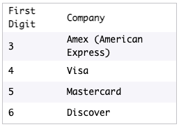

  

<h1 align="center">Project: Credit Card Checker</h1>

This project was created according to the open-ended [tasks](https://www.codecademy.com/paths/front-end-engineer-career-path/tracks/fecp-22-javascript-syntax-part-ii/modules/wdcp-22-credit-card-checker/projects/credit-card-checker)

##

## Project Goal
Context: The company that you work for suspects that credit card distributors have been mailing out cards that have invalid numbers. In this project, you have the role of a clerk who checks if credit cards are valid. Every other clerk currently checks using pencil and paper, but you’ll be optimizing the verification process using your knowledge of functions and loops to handle multiple credit cards at a time. Unlike the other clerks, you can spend the rest of your time relaxing!

## [Tasks](https://www.codecademy.com/paths/front-end-engineer-career-path/tracks/fecp-22-javascript-syntax-part-ii/modules/wdcp-22-credit-card-checker/projects/credit-card-checker)

- Create a function #validatedCred()# with an array as parameter. The function has to return true when an arrary contains digits of a valid credit card number and false when it is invalid. To accomplish that should be used the [Luhn Algorithm](#LuhnAlgorithm)
- Create a function #findInvalidCards()# that has to check through the rested array for which numbers are invalid, and return another nested array of invalid cards.
- Create #idInvalidCardCompanies()# to identify the credit card company of the invalid cards. If the number isn't listed print *'Company not found'*

  

## Luhn Algorithm

The Luhn algorithm is a series of mathematical calculations used to validate certain identification numbers, e.g. credit card numbers. The calculations in the Luhn algorithm can be broken down as the following steps:
- Starting from the farthest digit to the right, AKA the check digit, iterate to the left.
- As you iterate to the left, every other digit is doubled (the check digit is not doubled). If the number is greater than 9 after doubling, subtract 9 from its value.
- Sum up all the digits in the credit card number.
- If the sum modulo 10 is 0 (if the sum divided by 10 has a remainder of 0) then the number is valid, otherwise, it’s invalid.

  

